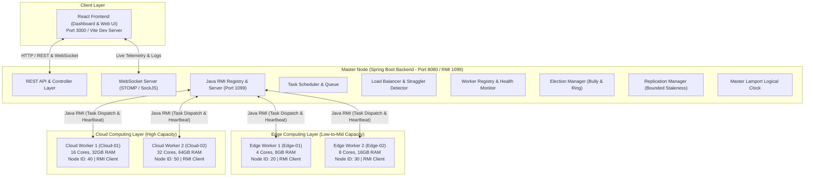
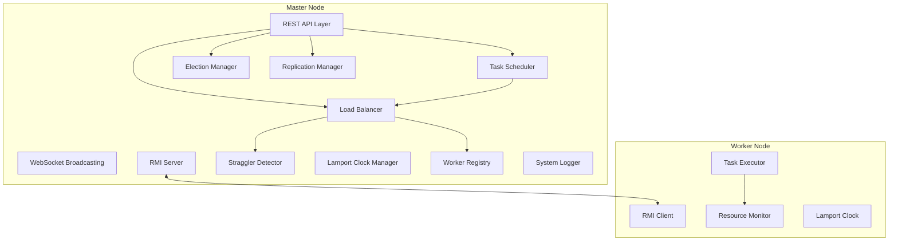

# Heterogeneity-Aware Cloud-Edge Load Balancing & Resource Scheduling Framework

A unified, real-time distributed computing platform integrating 6 classic distributed systems experiments into a heterogeneity-aware framework. The system dynamically detects performance degradation ("stragglers") across asymmetric cloud-edge hardware topologies and rebalances iterative workloads to guarantee bounded completion times.

---

## 1. Project Objective

In real-world distributed machine learning (ML) and batch compute workflows, cluster nodes are inherently heterogeneous. Edge devices (IoT gateways, mobile servers, embedded boards) operate alongside high-throughput centralized Cloud instances. When workloads are distributed uniformly or statically:
- **The Straggler Problem**: Slower or throttled workers delay synchronization barriers, causing faster workers to sit idle and degrading total cluster throughput.
- **Resource Underutilization**: High-capacity cloud nodes finish their static quota early while resource-constrained edge nodes struggle with compute-intensive tasks.
- **Dynamic System Variance**: Thermal throttling, transient network latency, and fluctuating background processes induce unexpected runtime degradation.

### Goal
This project provides a **heterogeneity-aware dynamic load balancing and resource scheduling framework** that:
1. Calculates initial task distributions using a hardware capability scoring model.
2. Continuously tracks runtime worker performance and identifies stragglers using statistical throughput thresholds.
3. Dynamically reclaims pending and assigned tasks from straggler nodes and offloads them to idle or faster nodes without aborting in-flight work.
4. Implements fundamental distributed systems primitives—**Java Remote Method Invocation (RMI)**, **Concurrent Multithreading**, **Lamport Logical Clocks**, **Leader Election (Bully & Ring)**, and **Primary-Backup State Replication with Bounded Staleness**—under a modern Spring Boot + React stack.

---

## 2. Architecture

The framework consists of a **Spring Boot Master Backend** coordinating either physical LAN workers or internal simulated worker nodes, with an interactive **React Dashboard** providing live state inspection, topological visualizations, and manual fault injection.

### System Architecture Overview



### Master-Worker Component Architecture



---

## 3. Experiments Overview

The framework unifies 6 core distributed computing experiments into a single coherent system:

| Experiment | Title | Distributed Concept | System Component & Implementation |
|:---:|:---|:---|:---|
| **1** | Client-Server Communication using Java RMI | Remote procedure invocation, proxy objects, and interface contracts | Workers discover master via `LocateRegistry`, invoke remote methods (`registerWorker`, `reportHeartbeat`, `getAssignedTask`), and transmit task outcomes over network sockets. |
| **2** | Multithreading in Distributed Systems | Asynchronous task queues, concurrency control, and thread pooling | Master uses `ThreadPoolExecutor` to handle concurrent worker RPCs; workers run multi-core iterative math calculations in dedicated worker thread pools. |
| **3** | Clock Synchronization (Lamport Logical Clocks) | Happens-Before relation ($a \to b$), causal event ordering in distributed systems | Every node manages a monotonically increasing atomic integer clock. All RMI/WebSocket messages pass timestamps; timeline preserves partial causal order. |
| **4** | Bully and Ring Leader Election Algorithms | Distributed consensus, failover management, coordinator selection | Node priority based on ID ranking. If coordinator fails, nodes trigger either the Bully algorithm or Token Ring election to appoint a new leader. |
| **5** | Data Consistency and Replication | Primary-backup model, eventual consistency, bounded staleness | Master maintains the primary state; backup replicas track state mutations. Synchronization runs automatically whenever staleness $\Delta = v_{primary} - v_{backup} > \text{max.staleness}$. |
| **6** | Heterogeneity-Aware Dynamic Load Balancing | Asymmetric resource allocation, runtime telemetry, straggler elimination | Tasks are initially partitioned proportionally to hardware capability scores. Real-time throughput evaluation identifies stragglers and redistributes pending jobs. |

---

## 4. Experiment-to-Implementation Mapping

### Experiment 1: Java RMI Communication
- **Interface Definition**: `SchedulerService` extends `java.rmi.Remote`.
  ```java
  public interface SchedulerService extends Remote {
      WorkerInfo registerWorker(WorkerInfo worker) throws RemoteException;
      Task getAssignedTask(String workerId) throws RemoteException;
      void reportTaskCompletion(TaskResult result) throws RemoteException;
      void reportHeartbeat(HeartbeatData heartbeat) throws RemoteException;
      SchedulerStatus getSchedulerStatus() throws RemoteException;
      void sendElectionMessage(ElectionMessage message) throws RemoteException;
  }
  ```
- **Lifecycle Flow**:
  1. Master initiates `LocateRegistry.createRegistry(1099)` and exports `SchedulerServiceImpl` under the name `"SchedulerService"`.
  2. Workers invoke `LocateRegistry.getRegistry(masterIp, 1099).lookup("SchedulerService")` to get the remote stub.
  3. Worker registers its hardware specification (`cpuCores`, `ramGB`, `nodeType`, `nodeId`) and receives a registered session token.
  4. Worker schedules a periodic background timer (e.g., 3000 ms) calling `reportHeartbeat()`.
- **Primary Source Files**: `SchedulerService.java`, `SchedulerServiceImpl.java`, `RmiServer.java`, `WorkerNode.java`.

### Experiment 2: Multithreaded Execution
- **Master Concurrency**: Handled via Spring's asynchronous task execution alongside a `ScheduledExecutorService` running periodic health-checking, straggler polling, and replication pulses.
- **Worker Concurrency**: Workers utilize `ThreadPoolExecutor` with pool sizes calibrated to `Runtime.getRuntime().availableProcessors()`.
- **Synthetic Compute Kernel**: Instead of superficial sleep routines (`Thread.sleep`), tasks execute matrix transformations, numerical approximations, and iterative hashing routines to generate verifiable CPU loads.
- **Primary Source Files**: `TaskSchedulerService.java`, `SimulatedWorker.java`, `TaskExecutor.java`.

### Experiment 3: Lamport Clocks
- **Clock Mechanics**: Encapsulated in `LamportClock.java` using `AtomicInteger`.
- **Causal Rules**:
  - *Internal Event*: `clock.incrementAndGet()`
  - *Send Message Event*: Local clock is incremented; the new value is stamped onto outgoing DTOs (`message.setTimestamp(clock.get())`).
  - *Receive Message Event*: Upon receipt of message with timestamp $T$, the local clock updates:
    $$\text{clock} = \max(\text{local\_clock}, T) + 1$$
- **Monitored Events**: `TASK_RECEIVED`, `TASK_STARTED`, `TASK_COMPLETED`, `RESULT_SENT`, `HEARTBEAT`, `ELECTION_START`, `ELECTION_OK`, `COORDINATOR_ANNOUNCE`.
- **Visualization**: All events are pushed to the frontend via STOMP WebSocket and rendered in a causal sequence diagram and chronological timeline.
- **Primary Source Files**: `LamportClock.java`, `EventLogger.java`, `DistributedEvent.java`.

### Experiment 4: Leader Election
Both classical algorithms are supported and can be switched dynamically:
- **Bully Algorithm**:
  1. An active node detects master unresponsiveness (missed heartbeats).
  2. Node broadcasts `ELECTION` to all nodes with strictly higher IDs.
  3. If higher nodes reply with `OK`, the sender yields and awaits coordinator announcement.
  4. If no node responds within a timeout window, the initiating node assumes leadership and broadcasts `COORDINATOR` to all lower nodes.
- **Ring Algorithm**:
  1. Nodes are arranged in a logical ring ordered by ID: $N_1 \to N_2 \to \dots \to N_k \to N_1$.
  2. The detector constructs an `ELECTION` message containing its own ID and forwards it to its immediate successor.
  3. Each receiving node appends its active ID to the message payload and passes it along.
  4. Once the message completes a full loop and returns to initiator, the node with the highest ID is elected, and a `COORDINATOR` token circulates through the ring.
- **Primary Source Files**: `ElectionService.java`, `BullyElectionStrategy.java`, `RingElectionStrategy.java`.

### Experiment 5: Replication
- **Model**: Primary-Backup Architecture with Bounded Staleness ($\epsilon$-staleness).
- **Replicated State Store**: `SchedulerState` encapsulates:
  - Worker registry table and active health status.
  - Pending, active, and completed task queues.
  - Global job progress counters and current leader ID.
- **Bounded Staleness Metric**:
  $$\text{Staleness} = \text{Version}_{\text{primary}} - \text{Version}_{\text{backup}}$$
  - Updates increment `primary.version`.
  - Backup polls or receives differential patches.
  - When $\text{Staleness} > \text{max.staleness}$ (default: 10 mutations), an immediate synchronous flush is forced.
- **Primary Source Files**: `ReplicationManager.java`, `SchedulerState.java`, `BackupNodeService.java`.

### Experiment 6: Dynamic Load Balancing
- **Hardware Capability Score**:
  $$\text{HardwareScore} = \text{cpuCores} \times \text{cpuFreqGHz} \times \left(1 + \log_2(\text{ramGB})\right)$$
- **Effective Capacity**:
  $$\text{EffectiveCapacity} = \text{HardwareScore} \times (1 - \text{cpuUtilization}) \times \text{speedMultiplier}$$
- **Initial Task Allocation**:
  $$\text{Tasks}_i = \left\lfloor \text{TotalTasks} \times \frac{\text{EffectiveCapacity}_i}{\sum_{j} \text{EffectiveCapacity}_j} \right\rfloor$$
- **Straggler Detection Criterion**:
  A worker $i$ is categorized as a **STRAGGLER** if:
  $$\text{Throughput}_i < \text{straggler.threshold} \times \overline{\text{Throughput}}_{\text{active}}$$
  *(Default threshold: $0.6$ or $60\%$ of cluster mean).*
- **Dynamic Migration**:
  - The master identifies unexecuted tasks in the straggler's assigned queue (`PENDING` / `QUEUED`).
  - Tasks currently `RUNNING` on the straggler are preserved to prevent wasted execution cycles.
  - The master reclaims queued tasks and redistributes them to available high-throughput workers.
- **Primary Source Files**: `LoadBalancerService.java`, `StragglerDetector.java`.

---

## 5. How to Run in Demo Mode

Demo mode executes the entire cluster on a single workstation by initializing 4 simulated worker threads representing heterogeneous hardware nodes.

### Step 1: Launch Backend
```bash
# Navigate to backend directory
cd backend

# Run Spring Boot backend (defaults to demo mode)
mvn spring-boot:run
```
*The master launches on port `8080` (REST & WebSocket) and starts an embedded RMI Registry on port `1099`.*

### Step 2: Launch Frontend
```bash
# Open a separate terminal and navigate to frontend directory
cd frontend

# Install dependencies (first time only)
npm install

# Start Vite development server
npm run dev
```
*Open your browser and navigate to `http://localhost:3000`.*

### Preconfigured Simulated Workers in Demo Mode
| Worker Name | Type | Virtual Specs | Baseline Speed Multiplier | Default Behavior |
|:---|:---:|:---|:---:|:---|
| **Edge-01** | EDGE | 4 Cores, 8 GB RAM | $1.0\times$ | Standard edge gateway node |
| **Edge-02** | EDGE | 8 Cores, 16 GB RAM | $2.0\times$ | Mid-tier local edge server |
| **Cloud-01** | CLOUD | 16 Cores, 32 GB RAM | $5.0\times$ | High-speed cloud compute instance |
| **Cloud-02** | CLOUD | 32 Cores, 64 GB RAM | $8.0\times$ | High-throughput enterprise cloud VM |

---

## 6. How to Run Across 4 Physical PCs

Deploy the application across multiple bare-metal or virtual machines connected to the same Local Area Network (LAN).

```
                      +-----------------------------+
                      |       PC 1 (MASTER)         |
                      | IP: 192.168.1.100           |
                      | - Spring Boot Backend (8080)|
                      | - RMI Registry (1099)       |
                      | - React Frontend (3000)     |
                      +--------------+--------------+
                                     |
         +---------------------------+---------------------------+
         |                           |                           |
+--------+--------+         +--------+--------+         +--------+--------+
|  PC 2 (WORKER)  |         |  PC 3 (WORKER)  |         |  PC 4 (WORKER)  |
| 192.168.1.101   |         | 192.168.1.102   |         | 192.168.1.103   |
| Worker: Edge-01 |         | Worker: Edge-02 |         | Worker: Cloud-01|
| Node ID: 20     |         | Node ID: 30     |         | Node ID: 40     |
+-----------------+         +-----------------+         +-----------------+
```

### Prerequisites
1. **JDK 17+** installed on all PCs and added to system `PATH`.
2. **Node.js 18+** installed on PC 1 (Master).
3. All PCs joined to the same subnet (e.g., `192.168.1.0/24`).
4. Local firewall rules opened for ports `1099`, `8080`, and `3000` on PC 1.

### Step 1: Set Up PC 1 (Master)
```bash
# In terminal 1 (PC 1)
cd backend
mvn clean package -DskipTests

# Start Spring Boot backend in LAN mode
java -jar target/dc-lab-backend.jar --app.mode=lan --app.master.ip=192.168.1.100

# In terminal 2 (PC 1)
cd frontend
npm run dev -- --host 0.0.0.0
```

### Step 2: Set Up PC 2 (Worker 1: Edge-01)
```bash
cd backend
java -cp target/dc-lab-backend.jar com.dclab.worker.WorkerNode \
  --master.ip=192.168.1.100 \
  --worker.id=Edge-01 \
  --worker.type=EDGE \
  --node.id=20
```

### Step 3: Set Up PC 3 (Worker 2: Edge-02)
```bash
cd backend
java -cp target/dc-lab-backend.jar com.dclab.worker.WorkerNode \
  --master.ip=192.168.1.100 \
  --worker.id=Edge-02 \
  --worker.type=EDGE \
  --node.id=30
```

### Step 4: Set Up PC 4 (Worker 3: Cloud-01)
```bash
cd backend
java -cp target/dc-lab-backend.jar com.dclab.worker.WorkerNode \
  --master.ip=192.168.1.100 \
  --worker.id=Cloud-01 \
  --worker.type=CLOUD \
  --node.id=40
```

---

## 7. How to Configure IP Addresses

The framework resolves network addresses through 4 fallback mechanisms:

```
+-----------------------------------------------------------+
| 1. Environment Variables (Highest Priority)               |
|    - MASTER_IP, WORKER_ID, NODE_TYPE, NODE_ID             |
+-----------------------------+-----------------------------+
                              | (If not defined)
+-----------------------------v-----------------------------+
| 2. External Config File                                   |
|    - config/config.properties                             |
+-----------------------------+-----------------------------+
                              | (If file missing)
+-----------------------------v-----------------------------+
| 3. Application Defaults                                   |
|    - backend/src/main/resources/application.yml           |
+-----------------------------+-----------------------------+
                              | (Overrides applied live)
+-----------------------------v-----------------------------+
| 4. Runtime Web UI                                         |
|    - Dashboard Settings Page (In-Memory / Dynamic update) |
+-----------------------------------------------------------+
```

### Example Environment Variable Configuration
**On Windows (PowerShell):**
```powershell
$env:MASTER_IP="192.168.1.100"
$env:WORKER_ID="Edge-01"
$env:NODE_TYPE="EDGE"
$env:NODE_ID="20"
```

**On Linux / macOS (Bash):**
```bash
export MASTER_IP=192.168.1.100
export WORKER_ID=Edge-01
export NODE_TYPE=EDGE
export NODE_ID=20
```

---

## 8. How to Start Master

### Via Maven Wrapper
```bash
cd backend
mvn spring-boot:run -Dspring-boot.run.arguments="--app.mode=lan --app.master.ip=192.168.1.100"
```

### Via Packaged Executable JAR
```bash
cd backend
mvn clean package -DskipTests
java -jar target/dc-lab-backend.jar --app.mode=lan --app.master.ip=192.168.1.100 --server.port=8080
```

---

## 9. How to Start Each Worker

Standalone workers run the `WorkerNode` client, connecting back to the Master's RMI Registry:

### Starting an Edge Worker
```bash
java -jar target/dc-lab-backend.jar \
  --role=worker \
  --master.ip=192.168.1.100 \
  --worker.id=Edge-01 \
  --worker.type=EDGE \
  --node.id=20
```

### Starting a Cloud Worker
```bash
java -jar target/dc-lab-backend.jar \
  --role=worker \
  --master.ip=192.168.1.100 \
  --worker.id=Cloud-01 \
  --worker.type=CLOUD \
  --node.id=40
```

---

## 10. Required Firewall Ports

Ensure inbound traffic is allowed on the following ports across all participating nodes:

| Port | Protocol | Service / Component | Required On | Description |
|:---:|:---:|:---|:---|:---|
| **1099** | TCP | Java RMI Registry | Master Node | Primary lookup registry for worker registration and RPC calls. |
| **8080** | TCP | REST API & WebSocket | Master Node | Serves REST endpoints to React UI and streams WebSocket updates. |
| **3000** | TCP | React Dev Server | Master (Dev only) | Vite web development server (production builds use static 8080). |
| **Dynamic** | TCP | RMI Anonymous Ports | All Nodes | Random ephemeral TCP ports negotiated by Java RMI for data transfer. |

> **Tip (Windows Firewall):** Run in elevated PowerShell to open required ports:
> ```powershell
> New-NetFirewallRule -DisplayName "DC-Lab RMI" -Direction Inbound -LocalPort 1099 -Protocol TCP -Action Allow
> New-NetFirewallRule -DisplayName "DC-Lab REST-WS" -Direction Inbound -LocalPort 8080 -Protocol TCP -Action Allow
> ```

---

## 11. How to Demonstrate Straggler Detection

1. Open the web dashboard at `http://localhost:3000` and navigate to **Job Submission**.
2. Configure a batch workload of **120 tasks** and click **Submit Job**.
3. Navigate to **Worker Monitor** to view active telemetry (CPU usage, throughput, task counters).
4. On the worker card for **Edge-02**, click **Simulate Straggler** (this injects an artificial 80% throttle).
5. Switch to the **Load Balancing** page:
   - Observe the throughput graph for **Edge-02** drop below the dotted line ($0.6 \times \text{Cluster Average}$).
   - Notice the status badge change from `HEALTHY` (Green) to `STRAGGLER` (Orange/Red).
   - An event `STRAGGLER_DETECTED` will appear in the system event log with Lamport timestamp.

---

## 12. How to Demonstrate Dynamic Redistribution

1. Begin with a larger workload (**250 tasks**) to observe continuous scheduling.
2. Allow initial allocation to distribute tasks according to the hardware capability scores (Cloud nodes receive the majority; Edge nodes receive a baseline share).
3. Click **Simulate Straggler** on **Edge-01**.
4. In the **Dynamic Load Balancing** view, watch the real-time redistribution cycle:
   - **Queue Audit**: The master freezes new task dispatch to **Edge-01**.
   - **Task Reclaim**: Remaining `PENDING` and `ASSIGNED` tasks assigned to Edge-01 are recalled into the master priority pool.
   - **Offloading**: Tasks are dynamically reassigned to **Cloud-01** and **Cloud-02**.
   - **In-flight Guarantee**: Tasks that are already `RUNNING` on Edge-01 finish their execution without being aborted or duplicated.
5. Review the **Job Completion Comparison**: Observe how dynamic offloading shortens total execution time compared to static scheduling baselines.

---

## 13. How to Demonstrate Bully Election

1. Navigate to the **Leader Election** page.
2. Select algorithm: **Bully Algorithm**.
3. Verify the current active coordinator is **Master Node (ID: 100)**.
4. Click **Simulate Master Failure**.
5. Observe the live algorithm trace:
   - Worker nodes detect missed heartbeats.
   - A node (e.g., Node 20) broadcasts `ELECTION` to nodes with higher IDs (30, 40, 50).
   - Node 30, 40, and 50 respond with `OK`.
   - Node 50 (highest alive ID) discovers no higher nodes respond.
   - Node 50 broadcasts `COORDINATOR` message to all nodes.
   - The UI updates the active coordinator banner to **Node 50**.

---

## 14. How to Demonstrate Ring Election

1. Navigate to the **Leader Election** page.
2. Select algorithm: **Ring Algorithm**.
3. Verify the logical topology displayed in the circular ring diagram:
   $$\text{Edge-01 (20)} \longrightarrow \text{Edge-02 (30)} \longrightarrow \text{Cloud-01 (40)} \longrightarrow \text{Cloud-02 (50)} \longrightarrow \text{Edge-01 (20)}$$
4. Click **Start Ring Election** (initiated from Node 20).
5. Watch the animated token traverse node-by-node:
   - Node 20 creates message `[20]` $\to$ Node 30 appends its ID `[20, 30]`.
   - Node 30 $\to$ Node 40 `[20, 30, 40]`.
   - Node 40 $\to$ Node 50 `[20, 30, 40, 50]`.
   - Token returns to initiator Node 20, which selects the maximum value: **Node 50**.
   - A `COORDINATOR [50]` announcement token circulates the ring to finalize the consensus.

---

## 15. How to Demonstrate Replication

1. Navigate to the **Data Replication** page.
2. Inspect the **Primary Node State** and **Backup Replica State**:
   - Both nodes start synchronized at Version 1 (`Staleness = 0`).
3. Click **Simulate Replica Network Delay** (toggles asynchronous lag on the backup link).
4. Run a new batch job from the **Job Manager** page.
5. Watch the version counter on the Primary increment rapidly with every task state mutation:
   - Version moves from $V_1 \to V_2 \to \dots \to V_{11}$.
   - Backup version remains at $V_1$.
   - **Staleness Counter** increments: $\Delta = V_{\text{primary}} - V_{\text{backup}} = 10$.
6. As soon as staleness exceeds `max.staleness=10`, the **Bounded Staleness Trigger** fires automatically:
   - A bulk delta synchronization executes.
   - The backup state jumps to the latest version.
7. Alternatively, click **Force Sync** at any time to run an immediate manual reconciliation.

---

## 16. How Lamport Clocks Work

Lamport logical clocks provide a monotonic mechanism to causally order events across distributed nodes that do not share synchronized physical hardware clocks.

### The Algorithm Rules
1. **Local Progression**:
   Before a node registers a local event $e$, it increments its local clock:
   $$C_i = C_i + 1$$
2. **Message Send**:
   When node $i$ sends message $m$ to node $j$, it attaches its current clock value $T_m = C_i$:
   $$\text{Message} = \langle m, T_m \rangle$$
3. **Message Receive**:
   Upon receiving message $\langle m, T_m \rangle$, node $j$ updates its clock before logging the receive event:
   $$C_j = \max(C_j, T_m) + 1$$

### Fundamental Properties
- **Happens-Before Relation ($a \to b$)**: If event $a$ causally precedes event $b$, then $C(a) < C(b)$.
- **Partial Order**: If neither $a \to b$ nor $b \to a$ holds, the events are concurrent ($a \parallel b$). While Lamport timestamps will arbitrarily order them, causality is never violated.
- **Traceability**: In this framework, every task allocation, heartbeat, straggler notification, and election vote is tagged with its Lamport timestamp, enabling unambiguous causal reconstruction of distributed runs.

---

## 17. Viva Explanation & Oral Defense Guide

### Q1: What core problem does this system solve?
> **Answer:** In heterogeneous distributed compute clusters (combining low-power edge nodes with high-performance cloud VMs), static or uniform task distribution causes edge nodes to become stragglers. The slowest worker dictates the completion time of the entire distributed job. This framework provides dynamic performance monitoring, straggler detection, and non-disruptive task redistribution to optimize overall job turnaround time.

### Q2: How does straggler detection work mathematically?
> **Answer:** We monitor the real-time throughput of each worker (tasks completed per unit time). When a worker's throughput drops below a configurable threshold (default: $0.6$ or $60\%$) of the cluster's active average throughput ($\text{Throughput}_i < 0.6 \times \overline{\text{Throughput}}$), that worker is flagged as a straggler.

### Q3: Why is static equal distribution inadequate in cloud-edge environments?
> **Answer:** Equal distribution assumes homogeneous compute capacity. A 4-core edge processor cannot process workloads at the rate of a 32-core cloud VM. Allocating equal tasks leads to early cloud idle time while the edge node experiences high queuing delay. Our framework initializes tasks proportional to a composite **Hardware Capability Score** ($Cores \times Freq \times [1 + \log_2(RAM)]$).

### Q4: What happens to tasks when a straggler is detected?
> **Answer:** Only tasks in `PENDING` or `ASSIGNED` states (queued but not yet executing) are recalled and redistributed. Tasks currently in the `RUNNING` state are permitted to finish locally. Aborting executing tasks would waste CPU cycles already invested.

### Q5: How is Java RMI used in this architecture?
> **Answer:** Java RMI provides remote procedure call communication between the master and worker nodes. The master publishes a remote stub for `SchedulerService` in an RMI registry on port 1099. Worker nodes look up the interface and call methods such as `registerWorker()`, `reportHeartbeat()`, and `reportTaskCompletion()` natively without needing custom transport protocols.

### Q6: What are the trade-offs between the Bully and Ring election algorithms?
> **Answer:**
> - **Bully Algorithm:** Higher message complexity ($O(n^2)$ worst-case) because any node can message all higher nodes, but election finishes rapidly in just a few message hops.
> - **Ring Algorithm:** Predictable $2n$ message overhead with clean unidirectional token passing, but higher latency since the token must traverse every intermediate hop sequentially.

### Q7: Why choose Bounded Staleness over Strict Consistency for state replication?
> **Answer:** Strict (synchronous) consistency requires two-phase commits or synchronous blocking across the network for every single state mutation, creating massive latency penalties. Bounded staleness allows asynchronous execution while guaranteeing that the replica never lags by more than $\epsilon$ versions ($\Delta \le 10$), satisfying the CAP theorem balance for distributed monitoring.

### Q8: How do Lamport logical clocks assist in debugging load balancing?
> **Answer:** Physical wall-clock times drift between separate machines due to clock skew. Lamport clocks establish a strict causal ordering ($a \to b \implies C(a) < C(b)$). This guarantees that we can reconstruct whether a task reallocation decision occurred before or after a straggler heartbeat was received.

---

## Tech Stack

- **Backend**: Java 17, Spring Boot 3.2, Java RMI, ExecutorService (`ThreadPoolExecutor`, `ScheduledExecutorService`)
- **Frontend**: React 18, Vite 5, Recharts (Data Visualizations), STOMP Client & SockJS (Real-Time WebSocket)
- **Networking & Protocols**: Java RMI (Port 1099), HTTP/REST (Port 8080), STOMP over WebSocket
- **Build & Package Management**: Apache Maven (Backend), npm (Frontend)

---

## Project Structure

```
dc_lab/
├── backend/
│   ├── pom.xml
│   └── src/main/java/com/dclab/
│       ├── DcLabApplication.java
│       ├── api/           # REST API Controllers (Jobs, Workers, Elections, Replication)
│       ├── clock/         # Lamport Logical Clock & Distributed Event Tracker (Exp 3)
│       ├── config/        # Spring & RMI Configuration Profiles
│       ├── demo/          # Simulated Cluster & Hardware Profile Generator
│       ├── election/      # Bully and Ring Leader Election Implementations (Exp 4)
│       ├── model/         # Task, Worker, Node, and Heartbeat Domain Entities
│       ├── replication/   # Primary-Backup Replication with Bounded Staleness (Exp 5)
│       ├── rmi/           # Java RMI Interfaces, Registries & Stubs (Exp 1)
│       ├── service/       # Task Scheduler (Exp 2) & Load Balancer / Straggler Detector (Exp 6)
│       └── websocket/     # STOMP WebSocket Broadcasting Endpoints
├── frontend/
│   ├── package.json
│   ├── vite.config.js
│   └── src/
│       ├── App.jsx
│       ├── App.css
│       ├── components/    # Reusable UI Cards, Metrics & Topologies
│       ├── hooks/         # WebSocket & Telemetry Subscriptions
│       ├── pages/         # Dashboard, Load Balancing, Election, Replication Pages
│       └── services/      # Axios REST & STOMP Client Services
├── config/
│   └── config.properties  # Cluster Node Topology & Scheduling Configuration
└── README.md
```

---

## License

This project is licensed under the **MIT License** — designed for educational, academic, and distributed computing laboratory instruction.
